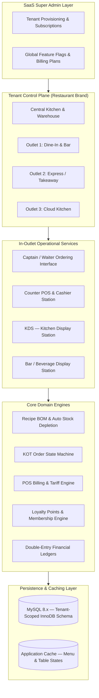
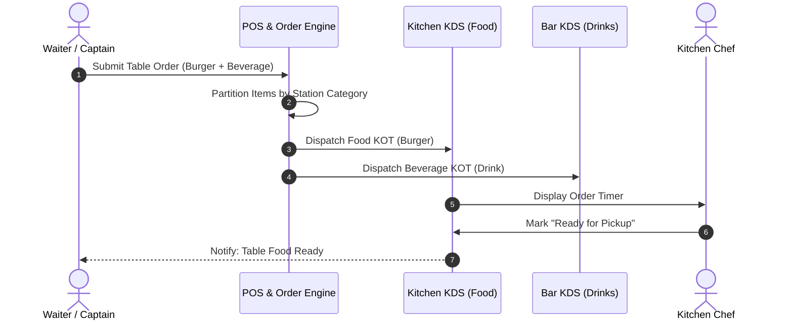

# 🍽️ DineFlow — Multi-Tenant SaaS Restaurant Management & Kitchen Automation Platform

[](https://laravel.com)
[](https://www.php.net/)
[](https://www.mysql.com/)
[]()
[]()

---

## 🔒 Confidential Production SaaS Project

> **Project Scope:** Multi-tenant SaaS platform built for multi-outlet restaurant chains, cloud kitchens, and dining establishments — covering recipe BOM formulation, live table management, Kitchen Order Ticket (KOT) routing, POS billing, automated ingredient inventory depletion, central kitchen logistics, customer loyalty, and financial accounting.

This repository documents my engineering work and system architecture on a multi-tenant Food & Beverage (F&B) SaaS ERP.

Specific client identifiers, database credentials, production data, and proprietary business configurations have been removed per confidentiality obligations.

> See [DISCLAIMER.md](./DISCLAIMER.md) for full confidentiality notice.

---

## ⚡ Engineering Snapshot (60-Second Overview)

DineFlow is a multi-tenant restaurant SaaS platform focused on transactional POS operations, recipe-driven inventory depletion, kitchen automation, and day-end financial reconciliation.

```
Key Engineering Focus Areas:
• Multi-tenant data isolation using Eloquent Global Scopes (tenant_id & outlet_id)
• Transaction-safe POS checkout and mathematical split-billing validation
• Pessimistic locking (SELECT ... FOR UPDATE) for concurrent ingredient inventory updates
• Event-driven Kitchen Order Ticket (KOT) station routing (Food → Kitchen, Drinks → Bar)
• Recipe BOM (Bill of Materials) linked to automated raw material deduction & COGS calculation
• Day-end shift close, blind cash drawer reconciliation, and automated double-entry JV posting
• Granular Role-Based Access Control (RBAC) across floor, kitchen, and administrative personnel
```

---

## 📑 Table of Contents

1. [Business Context & Problem Statement](#-1-business-context--problem-statement)
2. [Multi-Tenant SaaS Architecture](#-2-multi-tenant-saas-architecture)
3. [Engineering Decisions & Trade-offs](#-3-engineering-decisions--trade-offs)
4. [Implementation Status Matrix](#-4-implementation-status-matrix)
5. [Menu Engineering & Recipe BOM Engine](#-5-menu-engineering--recipe-bom-engine)
6. [Table Management & Order Routing (KOT / KDS)](#-6-table-management--order-routing-kot--kds)
7. [POS & Split-Billing Engine](#-7-pos--split-billing-engine)
8. [Automated Ingredient Stock Depletion](#-8-automated-ingredient-stock-depletion)
9. [Central Kitchen & Supply Chain Logistics](#-9-central-kitchen--supply-chain-logistics)
10. [Customer Loyalty & Membership Rewards](#-10-customer-loyalty--membership-rewards)
11. [Financial Accounting & Day-End Auditing](#-11-financial-accounting--day-end-auditing)
12. [Dynamic Role-Based Access Control (RBAC)](#-12-dynamic-role-based-access-control-rbac)
13. [Key Engineering Challenges & Solutions](#-13-key-engineering-challenges--solutions)
14. [My Role & Contributions](#-14-my-role--contributions)
15. [Tech Stack](#-15-tech-stack)

---

## 📌 1. Business Context & Problem Statement

Multi-outlet restaurant operations and cloud kitchens require synchronized workflows across front-of-house ordering, kitchen execution, inventory depletion, and financial reporting.

### Critical Industry Pain Points

| Operational Challenge | Business Impact |
|---|---|
| Disconnected POS and Kitchen Order Ticket (KOT) handoffs | Misplaced orders and delayed preparation during peak dining hours |
| Manual inventory tracking without recipe costing | Undetected portion variance, ingredient waste, inaccurate dish margins |
| Lack of multi-outlet central kitchen logistics | Inefficient batch prep and outlet stockouts |
| Inflexible billing (Split bill, item transfers, service charge) | Cashier bottlenecks and checkout delays |
| Manual cash drawer reconciliation | Shift-end discrepancies between physical cash and reported sales |
| Siloed accounting across branches | Delayed P&L and consolidated financial reporting |

### The Solution

A unified **Multi-Tenant SaaS Restaurant Platform** integrating front-of-house table service, kitchen execution, back-of-house recipe inventory costing, and centralized multi-branch financial accounting into a single real-time platform.

---

## 🏢 2. Multi-Tenant SaaS Architecture

The system uses a shared database with **tenant-scoped row-level isolation** (`tenant_id` and `outlet_id`), enabling multi-brand and multi-branch management within a single deployed instance.



---

## ⚖️ 3. Engineering Decisions & Trade-offs

| Architectural Decision | Chosen Approach | Rationale & Trade-offs |
|---|---|---|
| **Multi-Tenancy Model** | Shared Database with Row-Level Scoping (`tenant_id`, `outlet_id`) | Significantly lower infrastructure and operational overhead compared to multi-database setups, while maintaining strict isolation via centralized Global Scopes. |
| **Tenant Query Isolation** | Laravel Global Eloquent Scopes | Eliminates manual `where('tenant_id', ...)` filters in controller queries, preventing accidental cross-tenant data leaks. |
| **Concurrent Inventory Depletion** | Row-Level Pessimistic Locking (`SELECT ... FOR UPDATE`) | Guarantees atomic ingredient batch deductions across concurrent POS terminals, avoiding race conditions and negative inventory balances. |
| **Billing Consistency** | Database Transactions with Balance Assertion | Ensures order closure, payment receipt logging, and ingredient stock deductions commit together or roll back entirely. |
| **Kitchen Communication** | Event-Driven Station Dispatch | Decouples POS order processing from kitchen display rendering, routing food items to Kitchen KDS and drinks to Bar KDS independently. |
| **UI Architecture** | Blade Templates + AJAX + Vanilla JS | Optimal for low-latency in-restaurant POS terminals and touchscreens without the deployment complexity of separate single-page apps (SPAs). |

---

## 🚦 4. Implementation Status Matrix

| Module / Architectural Component | Status | Implementation Details |
|---|:---:|---|
| **Multi-Tenant Scoping Layer** | ✅ **Implemented** | Global Eloquent scopes filtering by `tenant_id` and active `outlet_id` |
| **Recipe BOM & Dish Formulation** | ✅ **Implemented** | Item-ingredient mapping, unit conversion, portion shrinkage, and food cost % |
| **Table & Floor Plan State Machine** | ✅ **Implemented** | Interactive table states (`Vacant`, `Occupied`, `Billed`, `Reserved`) with merging |
| **Kitchen Order Routing (KOT / KDS)** | ✅ **Implemented** | Event-driven station routing (Food to Kitchen, Drinks to Bar) with status updates |
| **POS & Split Billing Engine** | ✅ **Implemented** | Multi-tender checkout, $N$-way equal split, item-based split, and thermal print |
| **Automated Inventory Depletion** | ✅ **Implemented** | Atomic raw ingredient deduction on bill settlement with batch locking |
| **Customer Loyalty & Points Policy** | ✅ **Implemented** | Point accrual rules, tiered membership, and checkout redemption discounts |
| **Day-End Shift Close & Cash Audit** | ✅ **Implemented** | Blind cash counting, expected vs. actual variance tracking, and Z-report |
| **Double-Entry Accounting Integration** | ✅ **Implemented** | Automated JV posting on sales settlement, inventory COGS, and expenses |
| **Multi-Tier RBAC & Permissions** | ✅ **Implemented** | Granular role matrix for cashier, waiter, chef, manager, and tenant admin |
| **Central Kitchen Requisition & Transfer** | 🟡 **Core Complete** | Outlet requisition, batch prep dispatch, and GRN receiving workflows |
| **Consolidated Financial Reports** | 🟡 **Core Complete** | P&L, Trial Balance, Daily Sales Summary, and Dish Margin Reports |

---

## 🍲 5. Menu Engineering & Recipe BOM Engine

The platform links salable menu items directly to raw ingredient consumption through a structured **Bill of Materials (BOM)**:

```
Menu Item (e.g., Grilled Chicken Burger)
    ├── Raw Ingredient 1: Chicken Breast (200g)
    ├── Raw Ingredient 2: Burger Bun (1 pc)
    ├── Raw Ingredient 3: Cheddar Cheese (1 slice)
    ├── Raw Ingredient 4: Lettuce (30g)
    └── Raw Ingredient 5: Special Sauce (25ml)
```

- **Portion Control & Yields:** Accounts for raw-to-cooked shrinkage conversion factors (yield percentage).
- **Dish Costing & Margin Analysis:** Real-time food cost calculation based on ingredient purchase costs:

$$\text{Food Cost \%} = \left( \frac{\text{Total Ingredient Cost}}{\text{Menu Selling Price}} \right) \times 100$$

- **Modifier & Add-on BOMs:** Add-ons (e.g., *Extra Cheese*, *Double Patty*) carry individual ingredient sub-recipes that dynamically attach to the base order line.

---

## 🛎️ 6. Table Management & Order Routing (KOT / KDS)

### 6.1 Floor & Table Management

- **Visual Floor Plan:** Visual representation of restaurant sections (Main Hall, Terrace, VIP, Bar).
- **Table State Machine:**
  - `🟢 Vacant` $\rightarrow$ Available for seating
  - `🟡 Occupied` $\rightarrow$ Order active, food in prep
  - `🔵 Billed` $\rightarrow$ Invoice printed, awaiting payment settlement
  - `🟣 Reserved` $\rightarrow$ Pre-booked for specific time slot
- **Table Operations:** Table merging for large parties, table transfers (moving guests between tables), and item-level transfers.

### 6.2 KOT Routing & Kitchen Display System (KDS)



- **Station Partitioning:** Orders are split automatically by item category and routed to designated preparation stations.
- **Course Sequencing:** Supports firing sequence control (Appetizer $\rightarrow$ Main $\rightarrow$ Dessert).

---

## 💳 7. POS & Split-Billing Engine

Built for rapid checkout during dining operations:

- **Order Types:** Dine-In (Table-linked), Takeaway / Counter Pickup, and Direct Delivery.
- **Flexible Bill Splitting:**
  - Split equally by number of guests ($N$ ways).
  - Split by item selection (Guest A pays drinks, Guest B pays food).
- **Tariff & Tax Engine:**
  - Configurable VAT/Tax rates per item category.
  - Optional Service Charge (% or fixed amount).
  - Configurable discount rules (Loyalty, Corporate, Managerial complimentary with mandatory audit remark).
- **Multi-Tender Payments:** Single bill settled across multiple payment methods (e.g., Cash + Card split).
- **Hardware Integration:** ESC/POS network and USB thermal receipt printing, automated cash drawer trigger.

---

## 📦 8. Automated Ingredient Stock Depletion

When an order is settled at the POS, the system executes background ingredient stock deductions based on the dish's Recipe BOM:

```
Order Settled: 2x Grilled Chicken Burger
    │
    ├── Deduct from Inventory: Chicken Breast (-400g)
    ├── Deduct from Inventory: Burger Bun (-2 pcs)
    ├── Deduct from Inventory: Cheddar Cheese (-2 slices)
    ├── Deduct from Inventory: Lettuce (-60g)
    └── Deduct from Inventory: Special Sauce (-50ml)
```

- **Waste & Spoilage Logging:** Tracks kitchen prep waste, burnt dishes, and expired ingredients with reason codes.
- **Portion Variance Analysis:** Compares theoretical usage (from Recipe BOM) vs. physical count to identify portion variance or shrinkage.

---

## 🚚 9. Central Kitchen & Supply Chain Logistics

Designed for multi-outlet restaurant chains operating with a centralized commissary:

```
Outlet Requisition (Daily Stock Request)
    └── Central Kitchen Approval
            └── Batch Production Schedule
                    └── Dispatch Delivery Challan
                            └── Outlet Goods Receipt (GRN)
                                    └── Stock Ledger Balance Updated
```

- **Outlet Stock Requisitions:** Outlets raise daily stock replenishment requests based on min/max inventory levels.
- **Batch Production:** Central kitchen prepares bulk preps (marinades, sauces, dough) and dispatches via delivery challans.
- **Inter-Outlet Stock Transfers:** Raw material transfers between nearby branches with dual-verification dispatch/receive.

---

## 🎁 10. Customer Loyalty & Membership Rewards

- **Customer Profiling:** Tracks customer visit history, favorite dishes, and average ticket size.
- **Point Accrual Policy:** Configurable earning rules based on spend tiers.
- **Tiered Membership:** Tier-specific discount structures (Silver, Gold, Platinum).
- **Instant Redemption:** Real-time point deduction applied as checkout discount.

---

## 📊 11. Financial Accounting & Day-End Auditing

### 11.1 Day-End Shift & Cash Drawer Reconciliation

At the end of each shift or business day, cashiers execute a **Shift Close** process:

1. **System Expected Cash:** Computed as $\text{Cash Sales} - \text{Petty Cash Payouts} + \text{Opening Float}$.
2. **Physical Blind Count:** Cashier enters physical denomination counts without seeing system totals.
3. **Variance Report:** System computes Over / Short variance and logs discrepancies.
4. **Z-Report Generation:** Day-end summary printed and posted to financial accounts.

### 11.2 Double-Entry Accounting Integration

Key operational events automatically generate balanced journal vouchers:

| Business Event | Debit Account | Credit Account |
|---|---|---|
| POS Sales Settlement | Cash / Bank / Card Receivable | Food & Beverage Revenue |
| Recipe Ingredient Depletion | Cost of Goods Sold (COGS) | Raw Material Inventory |
| Ingredient Purchase (GRN) | Raw Material Inventory | Accounts Payable (Supplier) |
| Supplier Payment | Accounts Payable | Bank / Cash Account |

---

## 🔐 12. Dynamic Role-Based Access Control (RBAC)

| Role | Operational Scope |
|---|---|
| **SaaS Super Admin** | Tenant onboarding, subscription plan billing, global metrics |
| **Restaurant Owner / Admin** | All outlet analytics, menu pricing, recipe BOM, financial reports |
| **Branch / Floor Manager** | Table management, cashier shifts, discount authorizations, waste approval |
| **Cashier** | POS billing, split payments, invoice printing, shift closing |
| **Captain / Waiter** | Table order taking, KOT punching, modifier selection |
| **Kitchen Chef** | KDS display, order status updates, kitchen stock requests |
| **Store / Procurement Officer**| GRN, supplier orders, stock transfers, inventory counts |

---

## 💡 13. Key Engineering Challenges & Solutions

### Challenge 1: Pessimistic Locking for Concurrent Inventory Updates
**Problem:** When multiple POS terminals settle orders simultaneously, deducting complex recipe ingredient lines concurrently risked race conditions and negative inventory balances.

**Solution:** Ingredient stock deductions execute inside an atomic database transaction using row-level pessimistic locking (`SELECT ... FOR UPDATE`) on ingredient inventory records. If an ingredient has insufficient stock, the deduction logs a pending inventory variance alert rather than interrupting the cashier checkout flow.

---

### Challenge 2: Station-Specific Kitchen Order Routing
**Problem:** Order updates, item cancellations, or extra modifier additions made by waiters at the table needed to reflect on the kitchen display without full-page reloads.

**Solution:** Implemented an event-driven notification flow. When an order is confirmed or modified, the backend dispatches a station-specific payload to the corresponding KDS display channel, updating the kitchen queue in real time.

---

### Challenge 3: Multi-Tenant Data Scoping & Tenant Isolation
**Problem:** In a shared-database SaaS platform, a query from one restaurant brand must never accidentally expose or cross-contaminate data belonging to another tenant.

**Solution:** Applied an application-level Global Tenant Scope across all Eloquent models. Every database read/write query automatically filters by `tenant_id` and active `outlet_id`, preventing horizontal privilege escalation across tenants.

---

### Challenge 4: Split-Billing Consistency
**Problem:** Splitting an active dining bill across multiple guests with varying payment methods (cash, card, loyalty points) could lead to rounding discrepancies or unbilled items.

**Solution:** The billing engine enforces a mathematical balance check:

$$\sum (\text{Split Payments}) \equiv \text{Total Bill Amount} + \text{Taxes} + \text{Service Charge} - \text{Discounts}$$

The parent order is only marked settled once the sum of all child receipt ledger entries equals the master bill total.

---

## 👨‍💻 14. My Role & Contributions

**Role:** Full-Stack Software Engineer (PHP / Laravel)

### Architecture & System Design
- **Designed** the multi-tenant data scoping layer using Laravel global scopes and outlet-aware query constraints.
- **Designed** the Recipe Bill of Materials (BOM) data model and automated ingredient stock depletion logic.
- **Designed** the table state machine and visual floor plan management workflows.

### Core Implementation
- **Implemented** the POS billing engine supporting multi-tender settlement and split-billing validation.
- **Implemented** the KOT order routing and Kitchen Display System (KDS) station partitioning.
- **Implemented** the Day-End Shift close and blind-count cash drawer reconciliation workflow.
- **Implemented** the customer loyalty point accrual and checkout redemption logic.

### Integration & Workflows
- **Integrated** automated double-entry journal voucher generation for POS sales settlements and inventory COGS.
- **Integrated** the 3-layer RBAC permission system across store, kitchen, and administrative roles.
- **Developed** central kitchen requisition, delivery challan, and inter-outlet stock transfer workflows.

---

## 💻 15. Tech Stack

| Layer | Technologies |
|---|---|
| **Backend Framework** | PHP 8.2, Laravel 10.x (MVC, Eloquent ORM, Events, Queues) |
| **Database** | MySQL 8.x (InnoDB, Foreign Key Constraints, Pessimistic Locking) |
| **Frontend & POS UI** | Blade Templates, JavaScript ES6+, AJAX, Bootstrap 5 |
| **Architecture** | Multi-Tenant Shared Database, Event-Driven KOT Routing, BOM Recipe Costing |
| **Tooling & Hardware** | ESC/POS Thermal Printing, Barcode Generator, Artisan CLI, Composer |
